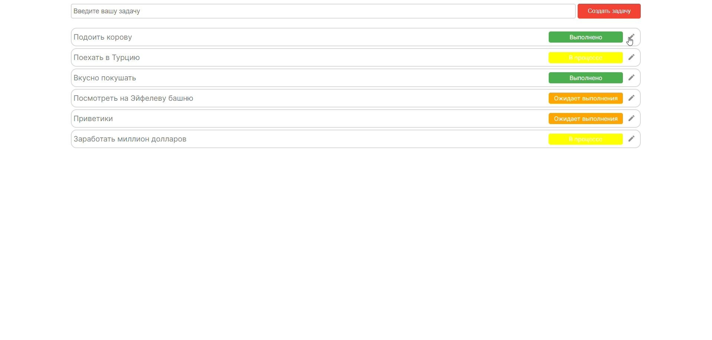
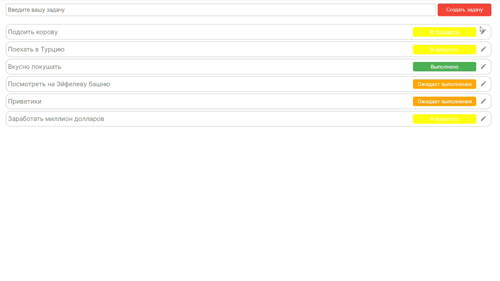
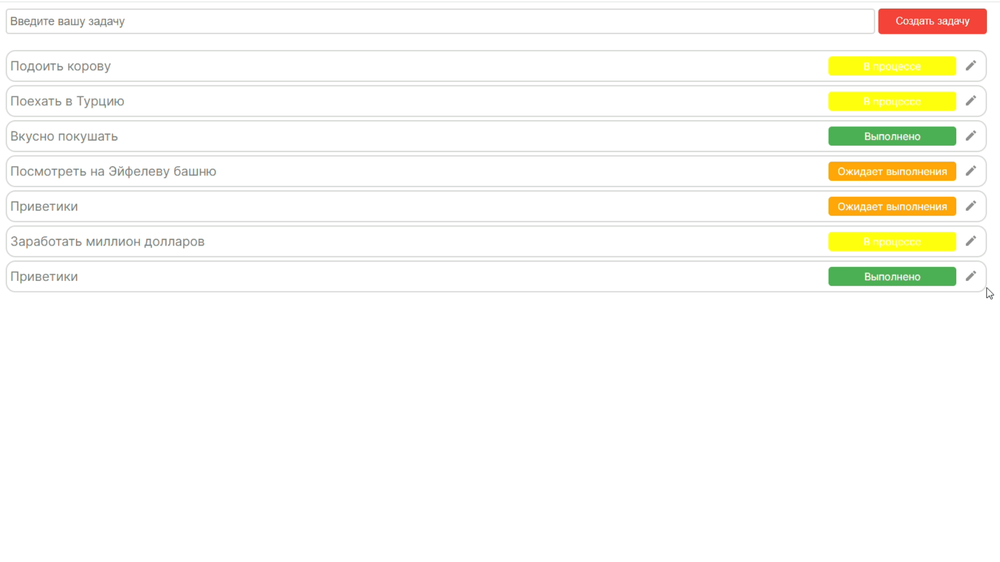

<h1 align="center">Project "ToDoList"</h1>

## Test

- **Copy repo** 
- **Try command "npm install", "npm run dev" for frontend.**
-  **For backend you must have the MongoDB database downloaded, then try command "npm install", "mongod", "npm run dev".**
-  **To run the application, run a parallel frontend and backend.**
-  **The site opens at the link: http://localhost:3000 .**
- **Wait... and... Congratulations!**

## Description

This project will help you record your notes.

## Used technologies: 

- **SCSS MODULES** 
- **HTML** 
- **NEXT JS**
- **REACT HOOK FORM**
- **AXIOS**
- **TS**
- **ExpressJS**
- **MongoDB**

## Add task

### Write something down!

## Edit task

### Have your plans changed? Let's fix this!

- **Enter title** 
- **Enter description** 
- **Enter status**

### **Congratulations!**

## Do you want to delete a task? No problem!

